## 计算机毕业设计hadoop+spark知网文献论文推荐系统 知识图谱 知网爬虫 知网数据分析 知网大数据 知网可视化 预测系统 大数据毕业设计 机器学习

## 要求
### 源码有偿！一套(论文 PPT 源码+sql脚本+教程)

### 
### 加好友前帮忙start一下，并备注github有偿文献推荐25
### 我的QQ号是2827724252或者798059319或者 1679232425或者微信:bysj2023nb 或bysj1688

# 

### 加qq好友说明（被部分 网友整得心力交瘁）：
    1.加好友务必按照格式备注
    2.避免浪费各自的时间！
    3.当“客服”不容易，repo 主是体面人，不爆粗，性格好，文明人。

## 装逼点
- ### 爬取知网数据作为基础数据集

- ### 使用hadoop+spark构建可视化大屏

- ### 基于协同过滤算法(物品+用户) SVD神经网络 MLP模型制作四种推荐算法的事项

- ### 使用KNN CNN GNN卷积神经构建预测系统

- ### 使用neo4j图数据库制作知识图谱图

- ### 其余含有AI 短信 支付、lstm情感分析模型等创新点

## 演示视频

https://www.bilibili.com/video/BV1bNtXetEzv/?spm_id_from=333.999.0.0

## 演示截图
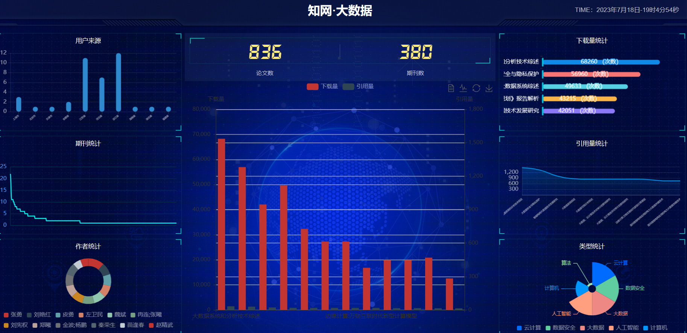
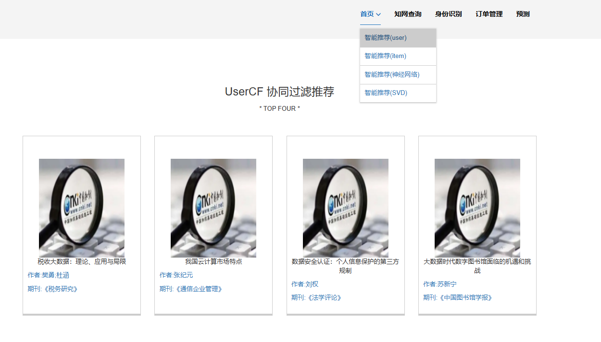
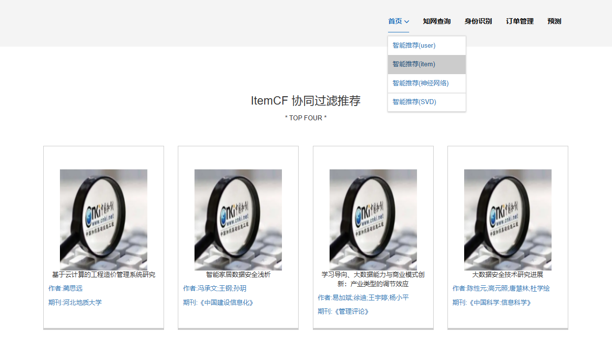
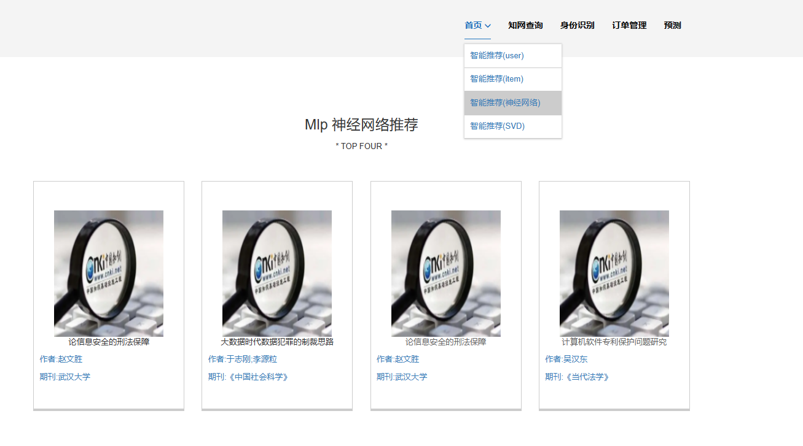
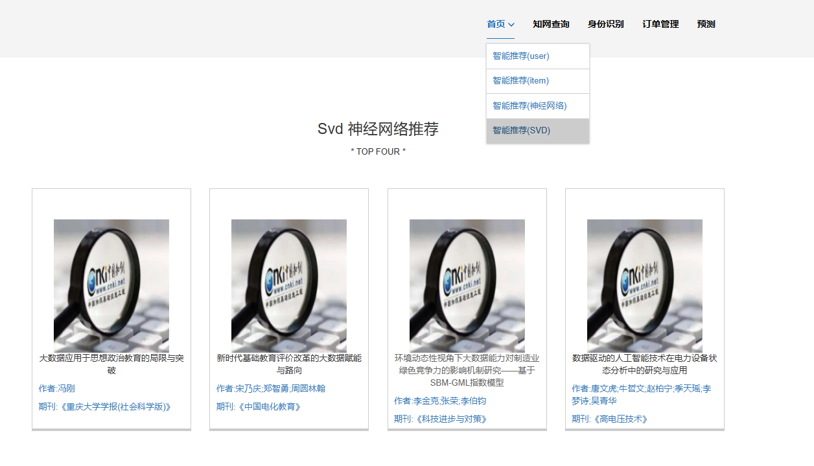
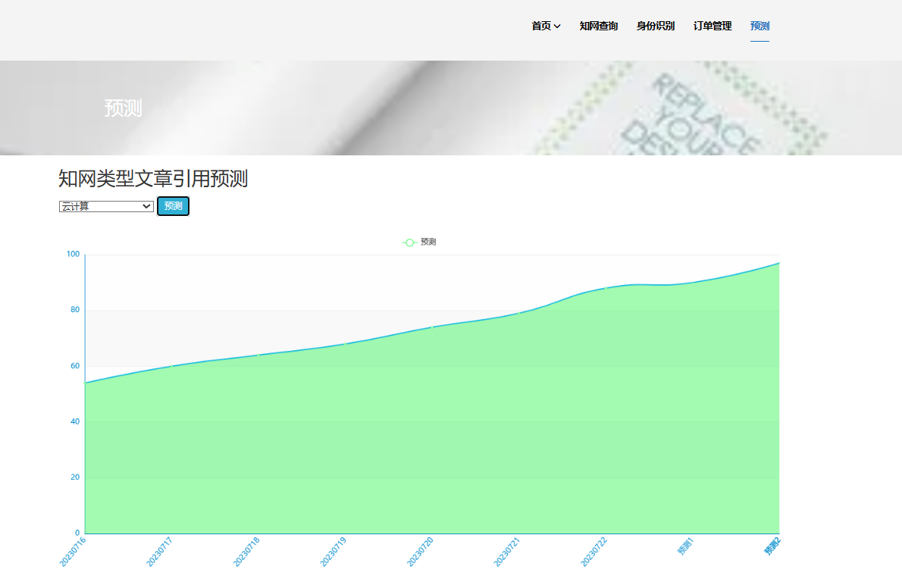
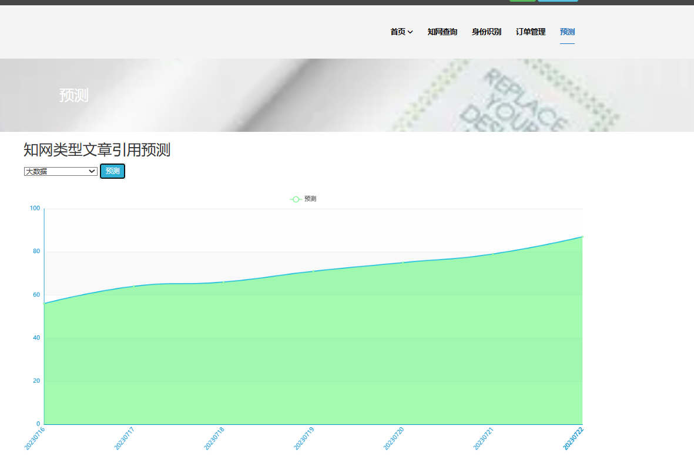
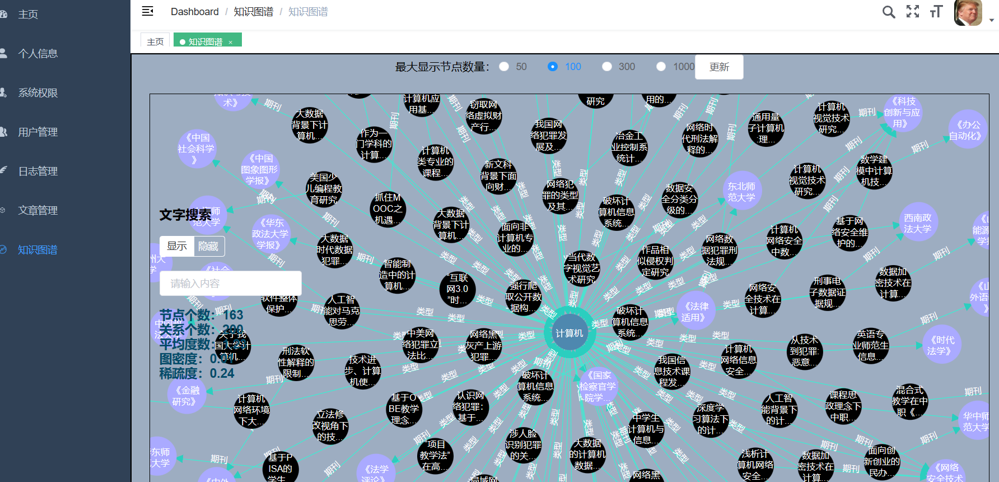
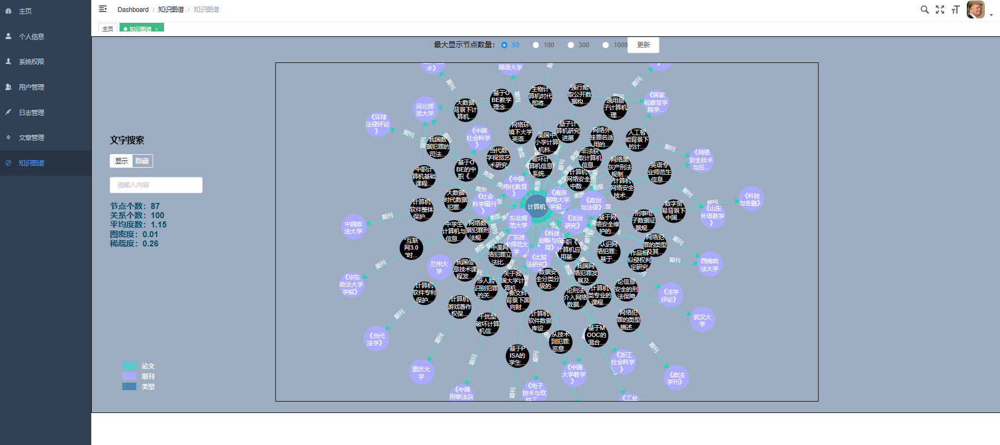
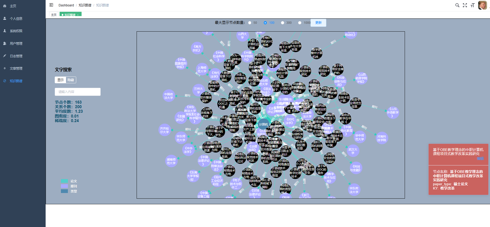
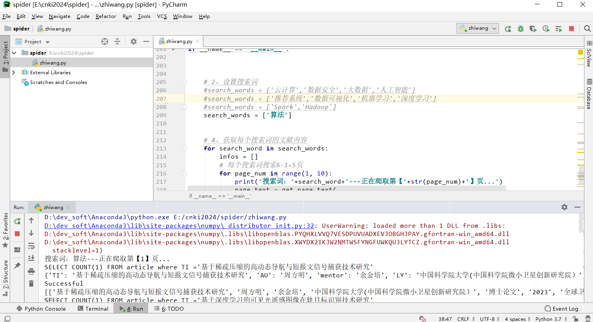
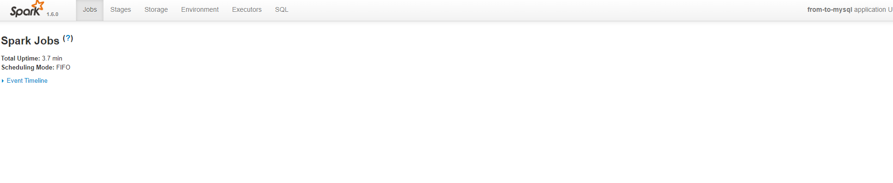

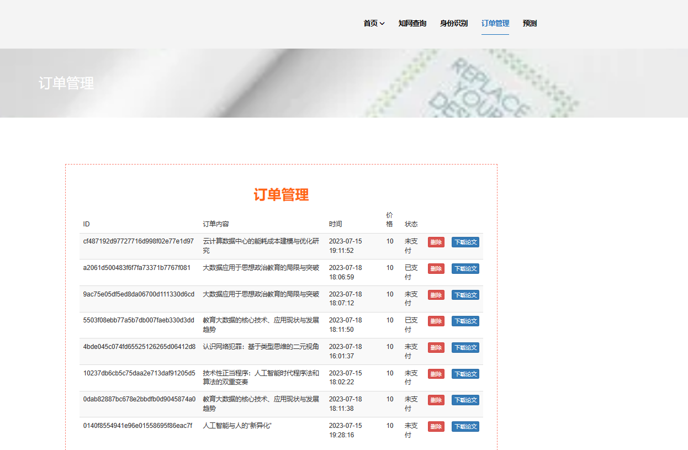
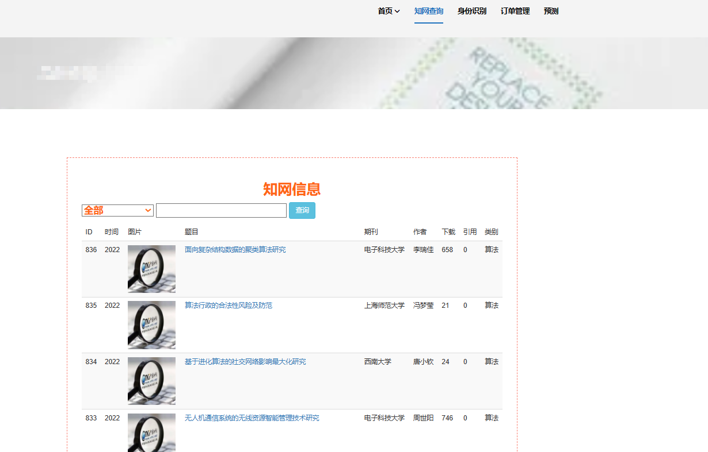
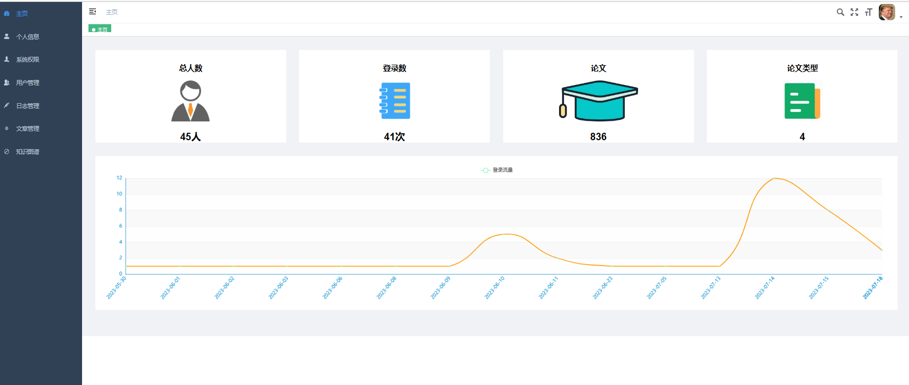
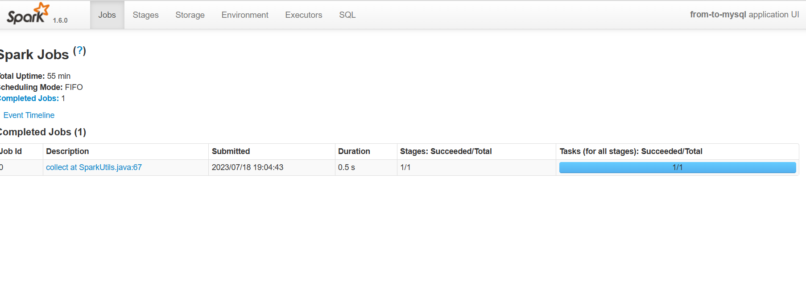

